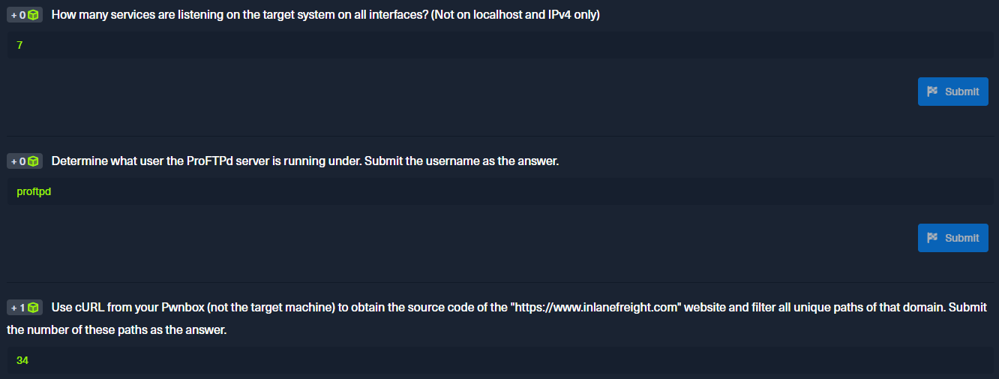

<h1>Hack The Box</h1>





<h2>Linux Fundamentals</h2>

<h3><u>System Information</u></h3>

Since we will be working with many different Linux systems, we need to learn the structure and the information about the system, its processes, network configurations, users, directories, user settings, and the corresponding parameters. Here is a list of the necessary tools that will help us get the above information. Most of them are installed by default.

`Command` Description:

- `whoami` Displays current username.
- `id` Returns users identity
- `hostname` Sets or prints the name of current host system.
- `uname` Prints basic information about the operating system name and system hardware.
- `pwd` Returns working directory name.
- `ifconfig` The ifconfig utility is used to assign or to view an address to a network interface and/or configure network interface parameters.
- `ip` Ip is a utility to show or manipulate routing, network devices, interfaces and tunnels.
- `netstat` Shows network status.
- `ss` Another utility to investigate sockets.
- `ps` Shows process status.
- `who` Displays who is logged in.
- `env` Prints environment or sets and executes command.
- `lsblk` Lists block devices.
- `lsusb` Lists USB devices
- `lsof` Lists opened files.
- `lspci` Lists PCI devices.

Examples:

Running `uname -a` will print all information about the machine in a specific order: kernel name, hostname, the kernel release, kernel version, machine hardware name, and operating system.

```
Linux box 4.15.0-99-generic #100-Ubuntu SMP Wed Apr 22 20:32:56 UTC 2020 x86_64 x86_64 x86_64 GNU/Linux
```

With this info, we could go and search for "4.15.0-99-generic exploit," and the first [result](https://www.exploit-db.com/exploits/47163) immediately appears useful to us.

The `id` command expands on the `whoami` command and prints out our effective group membership and IDs. This can be of interest to penetration testers looking to see what access a user may have and sysadmins looking to audit account permissions and group membership. In this output, the **hackthebox** group is of interest because it is non-standard, the **adm** group means that the user can read log files in **_/var/log_** and could potentially gain access to sensitive information, membership in the **_sudo_** group is of particular interest as this means our user can run some or all commands as the all-powerful **_root_** user. Sudo rights could help us escalate privileges or could be a sign to a sysadmin that they may need to audit permissions and group memberships to remove any access that is not required for a given user to carry out their day-to-day tasks.

```
uid=1000(cry0l1t3) gid=1000(cry0l1t3) groups=1000(cry0l1t3),1337(hackthebox),4(adm),24(cdrom),27(sudo),30(dip),46(plugdev),116(lpadmin),126(sambashare)
```

<h3><u>Files and directories</u></h3>

- `pwd`
- `lsblk`
- `ifconfig` tai `ip address`
- `ps`-komennolla saat infoa aktiivisista prosesseista.
  - `ps aux | grep proftpd`command will display a list of processes related to ProFTPd, and the user under which they are running.
- `echo "$SHELL"` -komennolla saat tiedon mitä shelliä käytät. vastaus voi olla esim. /bin/bash
- `ls -la` näyttää kaikki tiedostot (myös piilotetut). `Piilotetut` tiedostot tunnistat siitä, että ne alkavat pisteellä. Esim. `.bash_history`
- `find / -type f -name *.conf -user root -size +20k -newermt 2020-03-03 -exec ls -al {} \; 2>/dev/null` etsii tiedostojen sijaintia, jotka ovat tyyppiä file, päättyvät .conf -päätteeseen, rootin omistuksessa, kooltaan suurempia kuin 20kB, uudempia kuin 2020-03-03. `-exec ls -al {} \; 2>/dev/null` taas listaa lopuksi kaikki tiedostot niin, että jättää pois ne tiedostot, mitkä heittäisivät erroria esim. käyttöoikeuksien puolesta.
- `which` returns the path to the file or link that should be executed. This allows us to determine if specific programs, like cURL, netcat, wget, python, gcc, are available on the operating system
- `locate` In contrast to the `find` command, `locate` works with a local database that contains all information about existing files and folders.
  - `locate *.conf` find all files that has .conf extension.
- `sed`
- `awk`
- `tr` Another possibility to replace certain characters from a line with characters defined by us is the tool tr. As the first option, we define which character we want to replace, and as a second option, we define the character we want to replace it with. In the next example, we replace the colon character with space.
  - `cat /etc/passwd | sort | grep /bin/bash | tr ":" " " | column -t` listaa nätisti luettavassa muodossa lajiteltuna käyttäjät
- `cut` Specific results with different characters may be separated as delimiters. Here it is handy to know how to remove specific delimiters and show the words on a line in a specified position. One of the tools that can be used for this is cut. Therefore we use the option "-d" and set the delimiter to the colon character (:) and define with the option "-f" the position in the line we want to output.
  - `cat /etc/passwd | grep -v "false\|nologin" | cut -d":" -f1` listaa vain käyttäjänimet
- `grep`
- `ctrl + r` combolla saat etsittyä aikaisempia komentoja, joita olet käyttänyt
- `wc` it will often be useful to know how many successful matches we have. To avoid counting the lines or characters manually, we can use the tool `wc`. With the "`-l`" option, we specify that only the lines are counted.
  - `ss -l -4 | grep -v "127\.0\.0" | grep "LISTEN" | wc -l` How many services are listening on the target system on all interfaces? (Not on localhost and IPv4 only. 127.0.0 is localhost's ip address)
- `grep -E "^Password" /etc/ssh/sshd_config | grep yes` grepataan regexillä sshd_config -tiedostosta ne rivit, jotka alkavat sanalla password ja sisältävät myös sanan yes
  - ilman regexiä `grep password /etc/ssh/sshd_config | grep yes` mutta tämä kaikki tulokset, joissa vaan on sanat password ja yes
- `grep -E "yes$" /etc/ssh/sshd_config` grepataan sshd_config -tiedostosta ne rivit, jotka päättyvät sanaan yes

/etc/ssh/sshd_config tiedostosta regex -harjoituksia

1. Show all lines that do not contain the # character. `cat /etc/ssh/sshd_config | grep -E "#"`
   - `-E` for extended regex search patterns
2. Search for all lines that contain a word that starts with Permit. `cat /etc/ssh/sshd_config | grep -E "^Permit"`
   - ^ means that a line must start with string "Permit"
3. Search for all lines that contain a word ending with Authentication. ^`cat /etc/ssh/sshd_config | grep "Authentication$"`
   - $ means that a line must end with string "Authentication"
4. Search for all lines containing the word Key. `cat /etc/ssh/sshd_config | grep "Key"`
5. Search for all lines beginning with Password and containing yes. `cat /etc/ssh/sshd_config | grep "^Password.*yes"`
   - .\* is AND operator
6. Search for all lines that end with yes. `cat /etc/ssh/sshd_config | grep "yes$"`

/etc/passwd tiedostosta filteröinti -harjoituksia

1. A line with the username cry0l1t3. `cat /etc/passwd | sort`
2. The usernames. `cat /etc/passwd | sort | cut -d ":" -f1`
   - `-d` for delimeter. Colon is our delimeter in this case.
   - `-f1` for fields which are printed. In password file the username is the first
3. The username cry0l1t3 and his UID. `cat /etc/passwd | grep cry0l1t3 | cut -d ":" -f1,3`
   - in passwd file username is the first column and uid is the third column
4. The username cry0l1t3 and his UID separated by a comma (,). `cat /etc/passwd | grep cry0l1t3 | cut -d ":" -f1,3 | tr ":" ","`
   - in `tr` command the first character will be replaced with the second character.
5. The username cry0l1t3, his UID, and the set shell separated by a comma (,). `cat /etc/passwd | awk -F ":" '/^cry0l1t3:/ {print $1 "," $3 "," $7}'`
   - Could have with the same command as in ex. 4 but for a change wanted to try with `awk` command.
     - `-F ":"` sets the field separator
     - `/^cry0l1t3:/` matches the line starting with cry0l1t3. This is regex syntax. Otherwise you **_will_** get syntax error.
     - `{print $1 "," $3 "," $7}` prints the first field (username), third field (UID), and seventh field (shell), separated by commas.
6. All usernames with their UID and set shells separated by a comma (,). `cat /etc/passwd | awk -F ":" '{print $1 "," $3 "," $7}'`
7. All usernames with their UID and set shells separated by a comma (,) and exclude the ones that contain nologin or false. `cat /etc/passwd | cut -d ":" -f1,3,7 | tr ":" "," | grep -v "nologin"`
   - add `| column -s "," -t` to make a tab after each column instead of comma. A bit more readable ;)
8. All usernames with their UID and set shells separated by a comma (,) and exclude the ones that contain nologin and count all lines of the filtered output. `cat /etc/passwd | cut -d ":" -f1,3,7 | tr ":" "," | grep -v "nologin" | wc -l`

`cat /etc/passwd | sort | cut -d ":" -f1,3 | column -s ":" -t` to sort the list, filter the username and user id (uid) and make the output pretty by adding a column instead of colon.

Permissions

- `chown` command is change owner for short. You can change both owner (user) and ownergroup with this command.
  - Example01: `chown tester01 testfile.txt` tester01 owns the testfile.txt now
  - Example02: `chown tester01:testergroup testfile.txt` tester01 owns the file and it belongs to the group testergroup
- `chmod` command allows you to change the modes for the file(s). To change modes in number system you have to remember that **_r=4, w=2, x=1_** and we get the different modes when **_adding the values of numbers together_**. So, if we want to change the mode of a file so that the owner has every access, group has access for both read and write and others can not do anything with the file, the command is `sudo chmod 760 testfile.txt`.
  - r stands for read
  - w stands for write
  - x stands for execute

<u>**_Systemctl & Journalctl_**</u>

- **systemctl** may be used to introspect and control the state of the "systemd" system and service manager
- **journalctl** is used to print the log entries stored in the journal by systemd‐journald.service and systemd‐journal‐remote.service.

<h3><u>Security</u></h3>

One of the Linux operating systems' most important security measures is keeping the OS and installed packages up to date. This can be achieved with a command such as: `apt update && apt dist-upgrade`

Other options for further locking don Linux systems is Security-Enhanced Linux (`SELinux`) or `AppArmor`.

Besides, there are different applications and services such as Snort, chkrootkit, rkhunter, Lynis, and others that can contribute to Linux's security. In addition, some security settings should be made, such as:

- Removing or disabling all unnecessary services and software
- Removing all services that rely on unencrypted authentication mechanisms
- Ensure NTP is enabled and Syslog is running
- Ensure that each user has its own account
- Enforce the use of strong passwords
- Set up password aging and restrict the use of previous passwords
- Locking user accounts after login failures
- Disable all unwanted SUID/SGID binaries

This list is incomplete, as safety is not a product but a process. This means that specific steps must always be taken to protect the systems better, and it depends on the administrators how well they know their operating systems. The better the administrators are familiar with the system, and the more they are trained, the better and more secure their security precautions and security measures will be.
