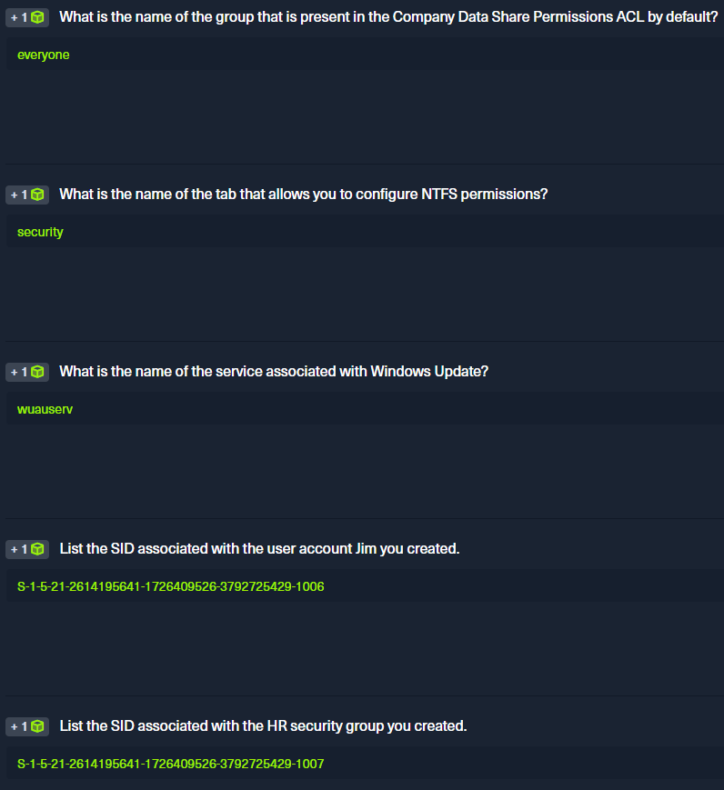

<h2>Windows Fundamentals</h2>

Pictures from the exercises:




<h3><u>Introduction to Windows</u></h3>

We can use the `Get-WmiObject` cmdlet to find information about the operating system.
For example, the following command shows us the version and buildnumber the operating system.

**_Important:_** use these command on Windows using Powershell.

```
Get-WmiObject -Class win32_OperatingSystem | select Version BuildNumber
```

Some other useful classes are `Win32_Process` to get a process listing, `Win32_Service` to get a listing of services, and `Win32_Bios` to get Basic Input/Output System (BIOS) information. Get-WmiObject can be used to start and stop services on local and remote computers, and more. Further information about the cmdlet can be found [here](https://ss64.com/ps/get-wmiobject.html) and [here](https://adamtheautomator.com/get-wmiobject/)

Remote Access is accessing a computer over a network. Some of the most common remote access technologies include but aren't limited to:

- Virtual Private Networks (VPN)
- Secure Shell (SSH)
- File Transfer Protocol (FTP)
- Virtual Network Computing (VNC)
- Windows Remote Management (or PowerShell Remoting) (WinRM)
- Remote Desktop Protocol (RDP)

About RDP:

- RDP listens by default on logical port 3389
- Remote Desktop Connection also allows us to save connection profiles. This is a common habit among IT admins because it makes connecting to remote systems more convenient.
- As `pentesters`, we can benefit from looking for these saved Remote Desktop Files (.rdp) while on an engagement.

<h4>Using Linux to access Windows machines</h4>

We can use a tool called `xfreerdp` to remotely access Windows targets. Connect via Remote Desktop (RDP) using the following command:

`xfreerdp /v:<targetIp> /u:htb-student /p:Password`

Cheat Sheet:

- `xfreerdp /v:<target IP address> /u:htb-student /p:<password>` RDP to lab target
- `Get-WmiObject -Class win32_OperatingSystem` Get information about the operating system
- `dir c:\ /a` View all files and directories in the c:\ root directory
- `tree <directory>` Graphically displaying the directory structure of a path
- `tree c:\ /f | more` Walk through results of the tree command page by page
- `icacls <directory>` View the permissions set on a directory
- `icacls c:\users /grant joe:f` Grant a user full permissions to a directory
- `icacls c:\users /remove joe` Remove a users' permissions on a directory
- `Get-Service` PowerShell cmdlet to view running services
- `help <command>` Display the help menu for a specific command
- `get-alias` List PowerShell aliases
- `New-Alias -Name "Show-Files" Get-ChildItem` Create a new PowerShell alias
- `Get-Module | select Name,ExportedCommands | fl` View imported PowerShell modules and their associated commands
- `Get-ExecutionPolicy -List` View the PowerShell execution policy
- `Set-ExecutionPolicy Bypass -Scope Process` Set the PowerShell execution policy to bypass for the current session
- `wmic os list brief` Get information about the operating system with wmic
- `Invoke-WmiMethod` Call methods of WMI objects
- `whoami /user` View the current users' SID
- `reg query <key>` View information about a registry key
- `Get-MpComputerStatus` Check which Defender protection settings are enabled
- `sconfig` Load Server Configuration menu in Windows Server Core

<h3><u>Operating System Structure</u></h3>

In Windows operating systems, the root directory is <drive_letter>:\ (commonly C drive). The root directory (also known as the boot partition) is where the operating system is installed. Other physical and virtual drives are assigned other letters, for example, Data (E:). The directory structure of the boot partition is as follows:

| Directory                  | Function                                                                                                                                                                                                                                                                                                                                                                                                                                                                                                                                                       |
| -------------------------- | -------------------------------------------------------------------------------------------------------------------------------------------------------------------------------------------------------------------------------------------------------------------------------------------------------------------------------------------------------------------------------------------------------------------------------------------------------------------------------------------------------------------------------------------------------------- |
| Perflogs                   | Can hold Windows performance logs but is empty by default.                                                                                                                                                                                                                                                                                                                                                                                                                                                                                                     |
| Program Files              | On 32-bit systems, all 16-bit and 32-bit programs are installed here. On 64-bit systems, only 64-bit programs are installed here.                                                                                                                                                                                                                                                                                                                                                                                                                              |
| Program Files (x86)        | 32-bit and 16-bit programs are installed here on 64-bit editions of Windows.                                                                                                                                                                                                                                                                                                                                                                                                                                                                                   |
| ProgramData                | This is a hidden folder that contains data that is essential for certain installed programs to run. This data is accessible by the program no matter what user is running it.                                                                                                                                                                                                                                                                                                                                                                                  |
| Users                      | This folder contains user profiles for each user that logs onto the system and contains the two folders Public and Default.                                                                                                                                                                                                                                                                                                                                                                                                                                    |
| Default                    | This is the default user profile template for all created users. Whenever a new user is added to the system, their profile is based on the Default profile.                                                                                                                                                                                                                                                                                                                                                                                                    |
| Public                     | This folder is intended for computer users to share files and is accessible to all users by default. This folder is shared over the network by default but requires a valid network account to access.                                                                                                                                                                                                                                                                                                                                                         |
| AppData                    | Per user application data and settings are stored in a hidden user subfolder (i.e., cliff.moore\AppData). Each of these folders contains three subfolders. The Roaming folder contains machine-independent data that should follow the user's profile, such as custom dictionaries. The Local folder is specific to the computer itself and is never synchronized across the network. LocalLow is similar to the Local folder, but it has a lower data integrity level. Therefore it can be used, for example, by a web browser set to protected or safe mode. |
| Windows                    | The majority of the files required for the Windows operating system are contained here.                                                                                                                                                                                                                                                                                                                                                                                                                                                                        |
| System, System32, SysWOW64 | Contains all DLLs required for the core features of Windows and the Windows API. The operating system searches these folders any time a program asks to load a DLL without specifying an absolute path.                                                                                                                                                                                                                                                                                                                                                        |
| WinSxS                     | The Windows Component Store contains a copy of all Windows components, updates, and service packs.                                                                                                                                                                                                                                                                                                                                                                                                                                                             |

Navigation in windows command line (a.k.a Powershell)

- `Get-Content` is equivalent in Windows for Linux's `cat` command
  - `Get-Content .\flag.txt` to read flag.txt file that is in working directory

<h4><u>Permissions</u></h4>

To see permissions in Windows it is very different compared to Linux.

- `icacls "C:\Users\"` to see permissions in Users directory.
  icacls comes from words **I**ntegrity **C**ontrol **A**ccess **C**ontrol **L**ist

NTFS permissions and share permissions are often understood to be the same. Please know that they are not the same but often apply to the same shared resource. Let’s take a look at the individual permissions that can be set to secure/grant objects access to a network share hosted on a Windows OS running the NTFS file system.

**_<u>Share permissions</u>_**
Permission | Description
-|-
Full Control | Users are permitted to perform all actions given by Change and Read permissions as well as change permissions for NTFS files and subfolders
Change | Users are permitted to read, edit, delete and add files and subfolders
Read | Users are allowed to view file & subfolder contents

**_<u>NTFS permissions</u>_**
Permission | Description
-|-
Full Control | Users are permitted to add, edit, move, delete files & folders as well as change NTFS permissions that apply to all allowed folders
Modify | Users are permitted or denied permissions to view and modify files and folders. This includes adding or deleting files
Read & Execute | Users are permitted or denied permissions to read the contents of files and execute programs
List folder contents | Users are permitted or denied permissions to read the contents of files and execute programs
Read | Users are permitted or denied permissions to read the contents of files
Write | Users are permitted or denied permissions to write changes to a file and add new files to a folder
Special Permissions | A variety of advanced permissions options

Do note that there are also **NTFS special permissions**!

Services:

- Windows has three categories of services: Local Services, Network Services, and System Services.
- Service statuses can appear as Running, Stopped, or Paused, and they can be set to start manually, automatically, or on a delay at system boot.
- In Windows, we have some critical system services that cannot be stopped and restarted without a system restart. If we update any file or resource in use by one of these services, we must restart the system.

**_Local Security Authority Subsystem Service (LSASS)_**

lsass.exe is the process that is responsible for enforcing the security policy on Windows systems. When a user attempts to log on to the system, this process verifies their log on attempt and creates access tokens based on the user's permission levels. LSASS is also responsible for user account password changes. All events associated with this process (logon/logoff attempts, etc.) are logged within the Windows Security Log. LSASS is an extremely high-value target as several tools exist to extract both cleartext and hashed credentials stored in memory by this process.

Windows Management Instrumentation (WMI)

WMI is a subsystem of PowerShell that provides system administrators with powerful tools for system monitoring. The goal of WMI is to consolidate device and application management across corporate networks.

Some of the uses for WMI are:

- Status information for local/remote systems
- Configuring security settings on remote machines/applications
- Setting and changing user and group permissions
- Setting/modifying system properties
- Code execution
- Scheduling processes
- Setting up logging

for example, The following command `wmic os list brief` lists information about the operating system.

Windows Management Console (MMC)

The MMC can be used to group snap-ins, or administrative tools, to manage hardware, software, and network components within a Windows host. We can also use MMC to create custom tools and distribute them to users. MMC works with the concept of snap-ins, allowing administrators to create a customized console with only the administrative tools needed to manage several services. These snap-ins can be added to manage both local and remote systems.

We can open MMC by just typing mmc in the Start menu. When we open MMC for the first time, it will be blank.

Windows Subsystem for Linux (WSL)

WSL is a feature that allows Linux binaries to be run natively on Windows 10 and Windows Server 2019. It was originally intended for developers who needed to run Bash, Ruby, and native Linux command-line tools such as sed, awk, grep, etc., directly on their Windows workstation.

WSL can be installed by running the PowerShell command Enable-WindowsOptionalFeature -Online -FeatureName Microsoft-Windows-Subsystem-Linux as an Administrator. Once this feature is enabled, we can either download a Linux distro from the Microsoft Store and install it or manually download the Linux distro of our choice and unpack and install it from the command line.

Window Security:

Skills Assessment - Windows Fundamentals

1. Creating a shared folder called Company Data
2. Creating a subfolder called HR inside of the Company Data folder
3. Creating a user called Jim
   - Uncheck: User must change password at logon
4. Creating a security group called HR
5. Adding Jim to the HR security group
6. Adding the HR security group to the shared Company Data folder and NTFS permissions list
   Remove the default group that is present - Share Permissions: Allow Change & Read - Disable Inheritance before issuing specific NTFS permissions - NTFS permissions: Modify, Read & Execute, List folder contents, Read, Write
7. Adding the HR security group to the NTFS permissions list of the HR subfolder
   - Remove the default group that is present
   - Disable Inheritance before issuing specific NTFS permissions
   - NTFS permissions: Modify, Read & Execute, List folder contents, Read, and Write
8. Using PowerShell to list details about a service

- `wmic useraccount get name,sid` to get user names and sid
- `wmic group get name,sid` to get group names and sid
