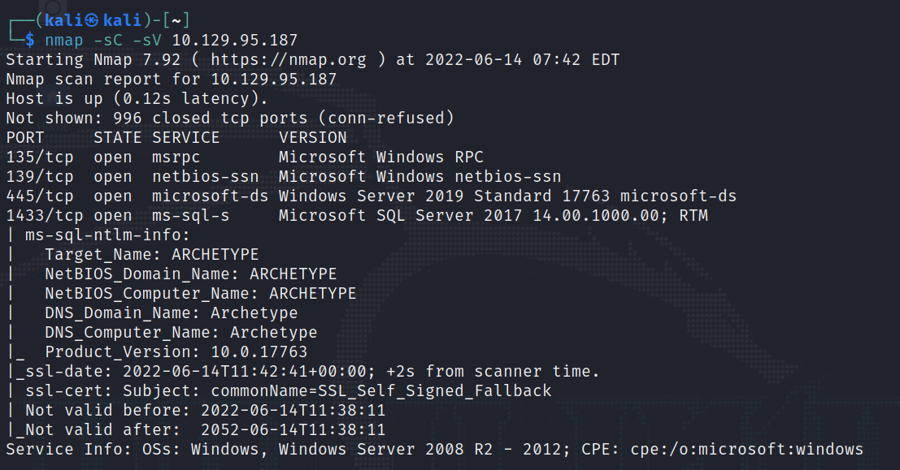
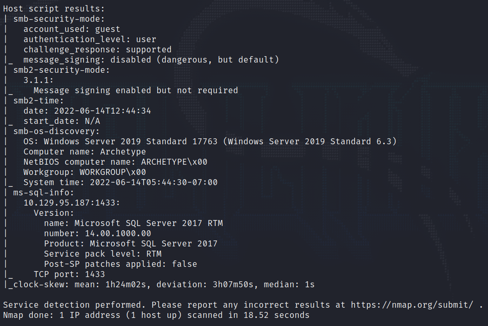
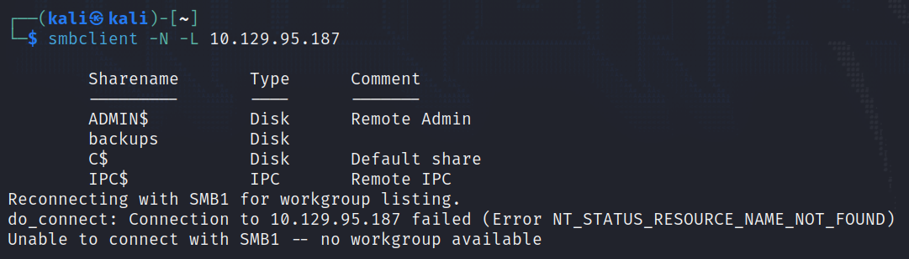
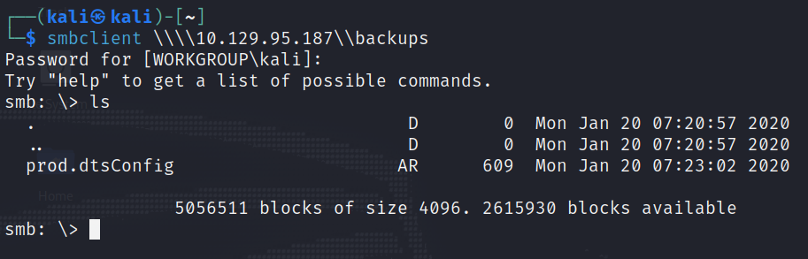
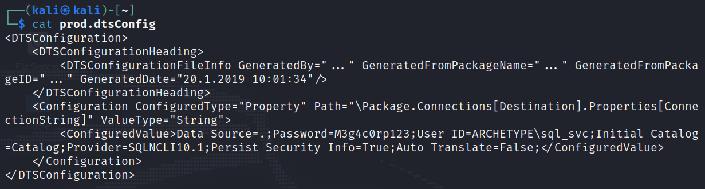
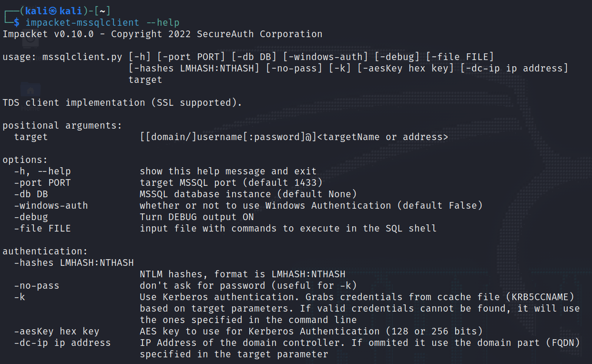
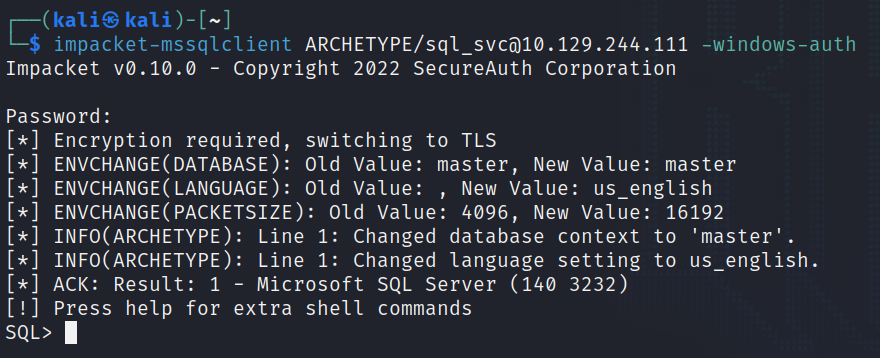
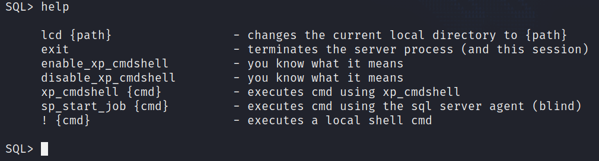

# Archtype

This is my ninth machine when learning the basics of penetration testing. Tags included in this machine are:

- SMB
- SQL

## <ins>**Questions**
* [Questions 1-4](Misc/questions_1.PNG)

## <ins>**Tasks**

We start by scanning the ports. We can see what ports and services are open.

For the next task we have to use smbclient so let us read some manuals and see which switch do we could use to get some answers for the next task(s).

We could try to get in with the following command. Switch -N do not ask for a password" and -L gets a list of shares that are available on a host. 

~~~
smbclient -N -L
~~~

Then we have to get in with sambaclient. Remember the funky syntax for getting in. Here is an example how we can get in.

Now we can use basic Linux commands to navigate through the folders and find some information.

Seems like the prodprod.dtsConfig is the only file we can find in the backups folder. So let us get that with get command and exit the database.

Now we have to open the file we got. Let us use google and hopefully get some answers.

Seems that we can open it normally without any problems. So let us use cat command and see the content.

For the next two tasks we can find answer simply by using google. For the last task we have to use the credentials we got from the file we downloaded from the smb server.

After a quick google we can find that Kali Linux has pre-installed software called impacket. With Impacket we can try getting in but first let us read some manuals

So now we can try getting in. Let us try the following command:

~~~
impacket-mssqlclient ARCHETYPE\sql_svc@<ip_address> -windows-auth
~~~

It gives a chance to put a password but does not get anywhere else. The right reason for this was the command we tried. Instead of putting backslash we have to put forward slash and it works like a charm. Now we got in after giving a right password.

And now that we got in we can hopefully get some help with help command. Let us try that one.

