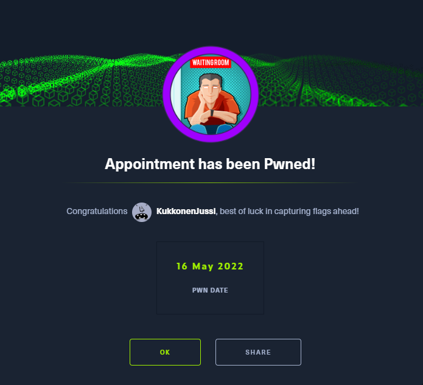
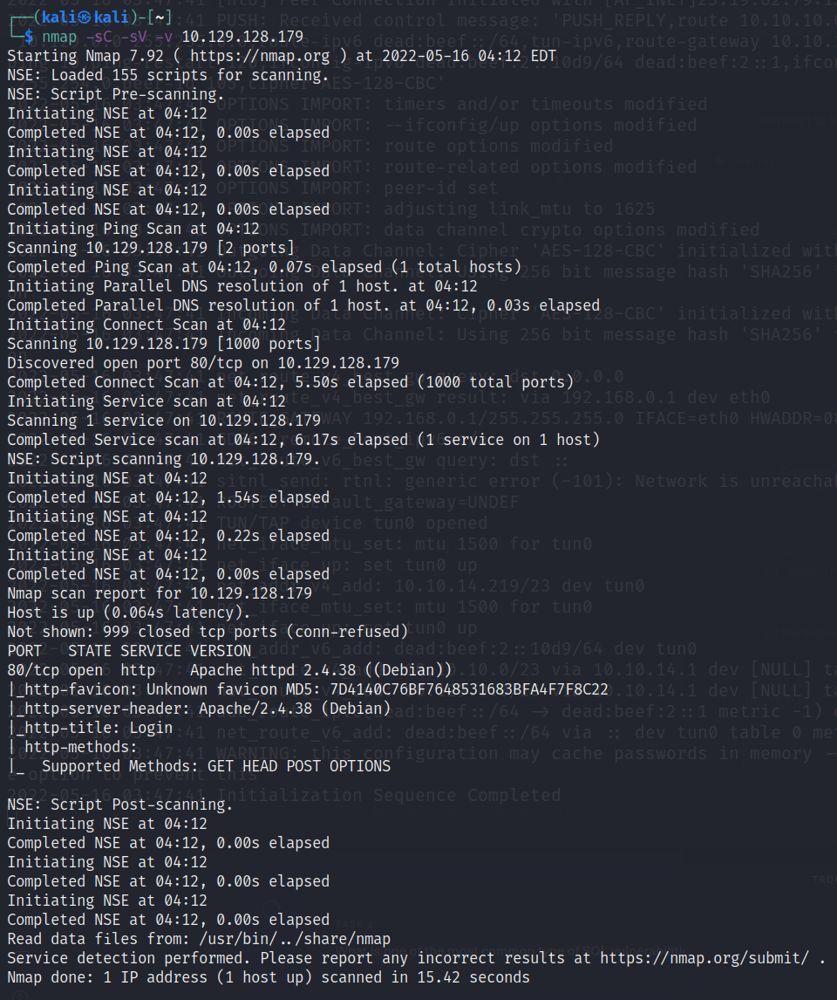
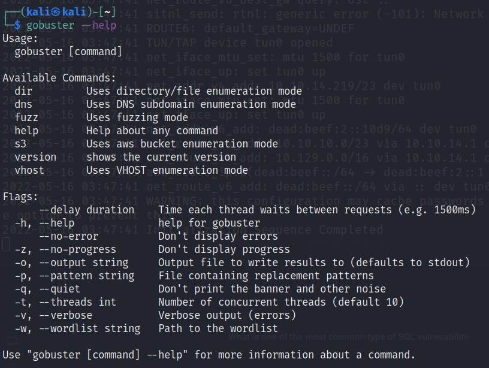
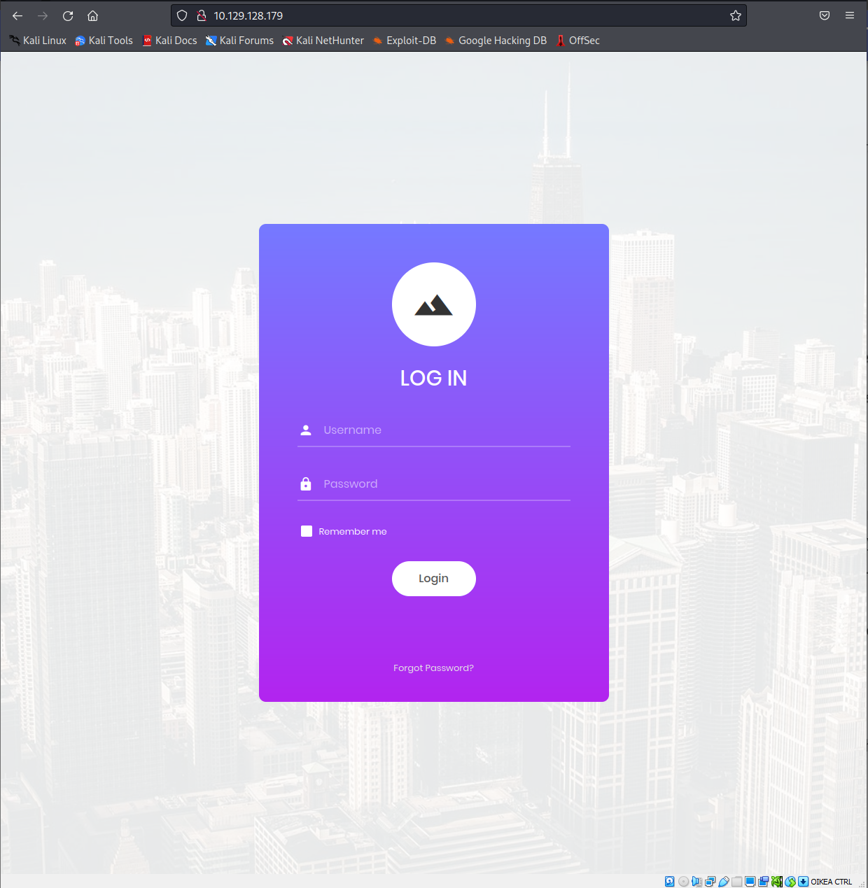
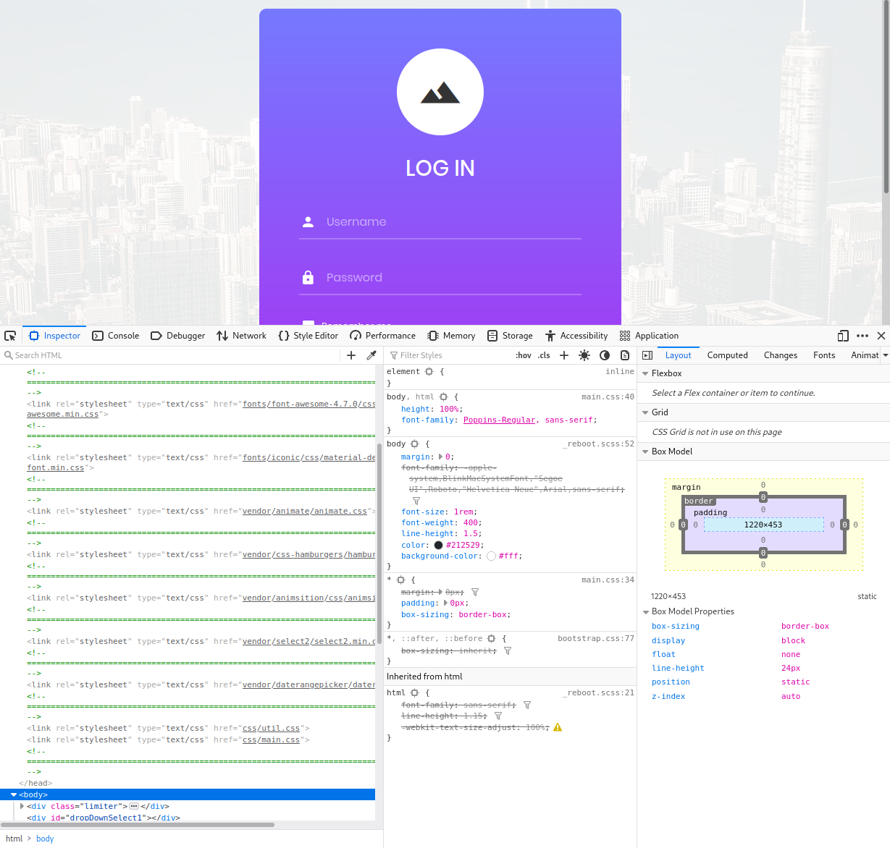
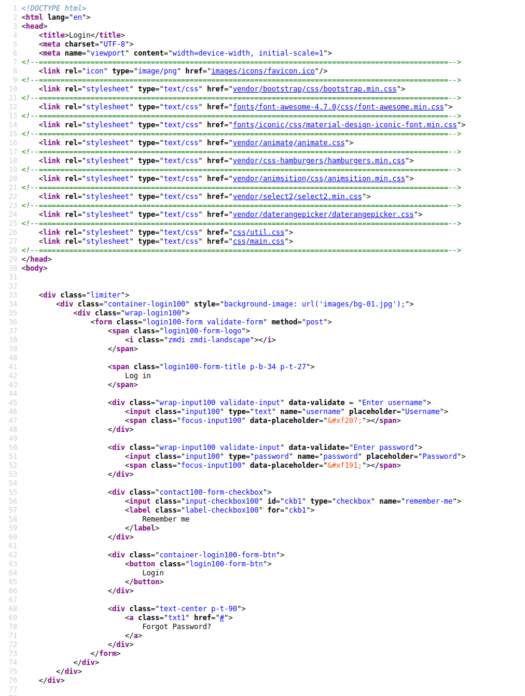
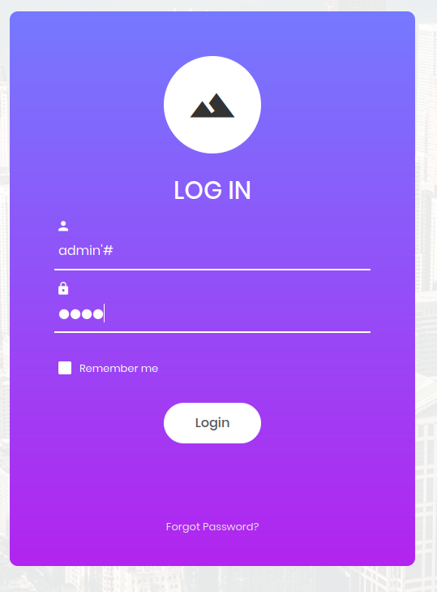
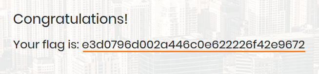

# Appointment

This is my fifth machine when learning the basics of penetration testing. Tags included in this machine are:

- SQL
- SQL Injection
- MariaDB

## <ins>**Questions**

* [Questions 1-4](Misc/questions_1.PNG)
* [Questions 5-8](Misc/questions_2.PNG)
* [Questions 9-11](Misc/questions_3.PNG)

## <ins>**Tasks**
If you look at the questions you can see that the main theme is now SQL. For the first question you have to google the answers (if you do not know them already) and then you can use <ins>**nmap**</ins> to the target machine.

As you proceed with the machine you have to install Gobuster to you machine ([Kali Linux](https://www.kali.org/) in my case) and read manuals from it with the following command:

~~~
gobuster --help
~~~

## <ins>**Flag**

If you open the browser and type the ip address of the machine you get this login page.

You can check some source code with either <ins>**F12**</ins> key or with <ins>**CTR + U**</ins> combination. Below are photos taken from both examples:

### F12

### CTR + U

Unfortunately we can not find any usernames or passwords from the source code. In this case let us try SQL Injection.

### <ins>**Injection**

We can try some default combinations. In the following examples username is first and password is the second word.

- admin - root
- administrator - password

In this case we did not get in. So let us google for some SQL login bypass methods.

After a quick search you can find a cheat sheet for SQL injection authentication bypass. There are a list of suggestions you can try. After a few tries the right username is the following:

~~~
admin' #
~~~

The hashtag sign will "comment out the parts of the code" as the final task says. In this case it will comment out the password entirely so that is why you do not need a password. You can type anything to the password field and get your flag.

And there you have it. You can submit the flag and move on to the next machine. Hurray!