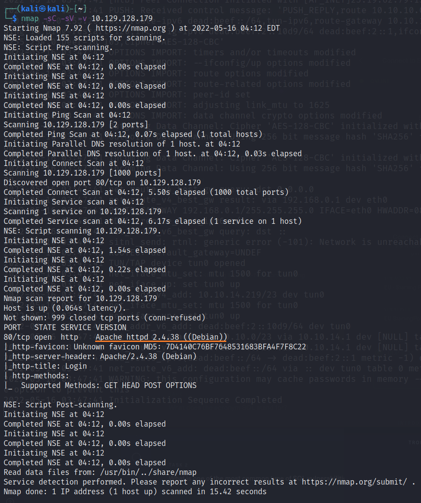

# Appointment

This is my fifth machine when learning the basics of penetration testing. Tags included in this machine are:

- SQL
- SQL Injection
- MariaDB

## <ins>**Questions**

* [Questions 1-4](Misc/questions_1.PNG)
* [Questions 5-8](Misc/questions_2.PNG)
* [Questions 9-11](Misc/questions_3.PNG)

## <ins>**Tasks**
If you look at the questions you can see that the main theme is now SQL. For the first question you have to google the answers (if you do not know them already) and then you can use <ins>**nmap**</ins> to the target machine.

As you proceed with the machine you have to install Gobuster to you machine ([Kali Linux](https://www.kali.org/) in my case) and read manuals from it with the following command:

~~~
gobuster --help
~~~

## <ins>**Flag**

