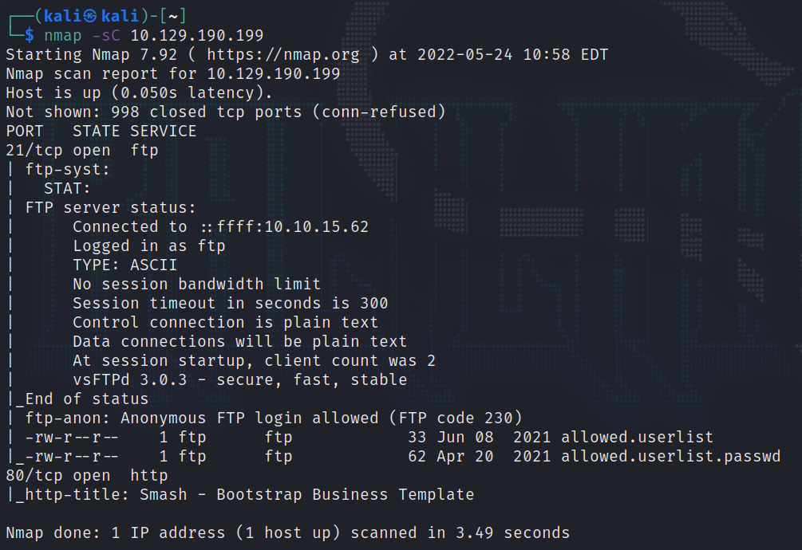

# Crocodile

This is my eigth machine when learning the basics of penetration testing. Tags in this machine are:

- PHP
- FTP

## <ins>**Questions**

* [questions 1-3](Misc/questions_1.PNG)

## <ins>**Tasks**

For the first questions you have to use nmap with -sC switch and look the output. 

## <ins>**Flag**
