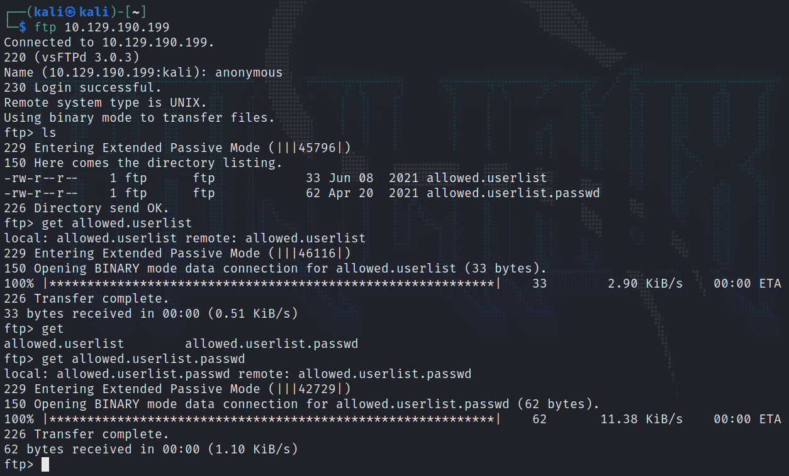
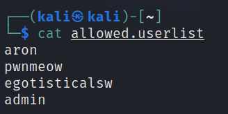
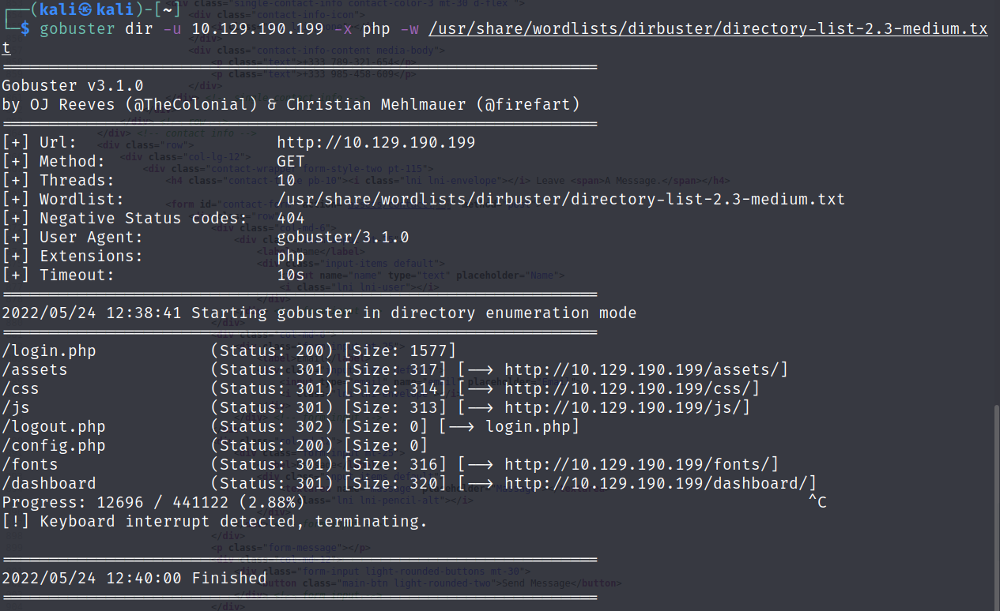

# Crocodile

This is my eigth machine when learning the basics of penetration testing. Tags in this machine are:

- PHP
- FTP

## <ins>**Questions**

* [questions 1-3](Misc/questions_1.PNG)
* [questions 4-6](Misc/questions_2.PNG)
* [questions 7-9](Misc/questions_3.PNG)

## <ins>**Tasks**

For the first questions you have to use nmap and look the output.

After this you have to use ftp command. From the previous picture we can see that you can get in the ftp as anonymous user so let us try that and see if we can get any files from there.

We got in and can download two files. Let us download those and then see what usernames we got in the file.

For the last task you have to go to the ip address of the target machine. It opens a website as follows.

For the last task the hint of the question says to find specific file type. Hint is php. After finding help for syntax we got in and found the answer for the last task. It was login.php

## <ins>**Flag**
