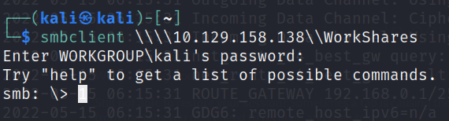
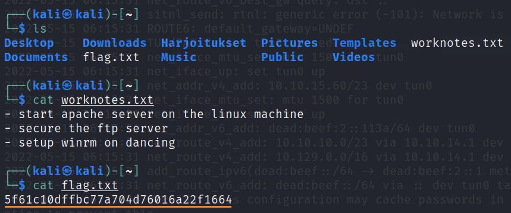

# Dance

This is my third machine when learning the basics of penetration testing. No visible tags included in this machine but **<ins>SMB</ins>** would be a fitting tag for this machine.

## <ins>**Questions**

* [Questions 1-4](Misc/questions_1.PNG)
* [Questions 5-8](Misc/questions_2.PNG)

## <ins>**Flag**

To get the flag you have to use <ins>**smbclient**</ins> command to connect to the machine.

In this picture you can see that WorkShares is available for anyone. Sign $ means that you have to be administrator to access them. To get into WorkShares folder we have to use funky syntax to access the folder.

After this you can use basic linux commands to see files and move from directory to another. Remember to use <ins>**get**</ins> command to download any files. Let us get both files from the directories as seen in the example below.

Exit the smb. Now we have to open those files with preferred command. I use <ins>**cat**</ins> command to open the files. The first file didn not contain the flag but the other one did as seen in the photo below.

And there we have the flag. You can now submit the flag and move on to the next machine. Hurray!