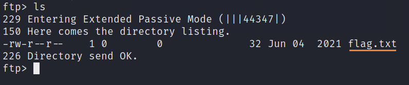

# Fawn

This is my second my machine when learning the basics of penetration testing. Tags included in this machine are:

- Enumeration
- FTP
- External
- Penetration Tester Level 1

## <ins>**Questions**

* [Questions 1-4](Misc/questions_1.PNG)
* [Questions 5-8](Misc/questions_2.PNG)

## <ins>**Flag**

To get this flag you can use <ins>**nmap**</ins> which shows some vulnerabilities. With the following command you can see operating system with the open ports:

~~~
nmap -sV -sC -v <ip-address>
~~~

In this picture you can see a hint. "Anonymous FTP login allowed". You can you <ins>**Anonymous**</ins> as username. There is no password so just press enter and you are in.

After this you can use <ins>**ls**</ins> command to see files in the directory. You can see the flag.txt in the directory.

You can not use <ins>**head**</ins> command to get the flag because ftp is file transfer service. In this case you have to use <ins>**get**</ins> command.

Exit the ftp and open the flag with preferred command. You can now submit the flag. Hurray!

