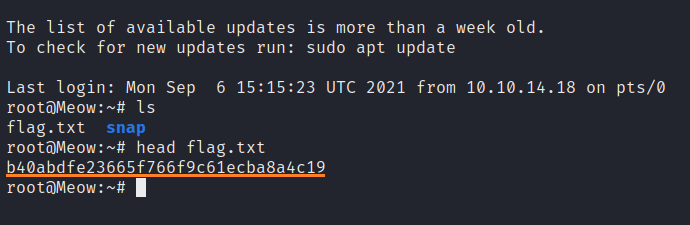

# Meow

This is my first my machine when learning the basics of penetration testing. Tags included in this machine are:

- Enumeration
- Telnet
- External
- Penetration Tester Level 1

## <ins>**Flag**

To get the flag you have to use <ins>**telnet**</ins> command to connect to the machine. The previous question hints that the user name is root.

After this you can use <ins>**ls**</ins> command to see files in the directory. You see the flag.txt and you and can open it with <ins>**head**</ins> command for example.

And there you have it. Submit the flag and Meow has been pwnd as the achievent also says so. Hurray!