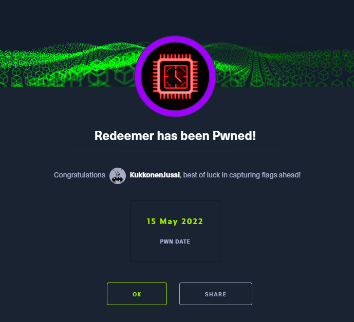
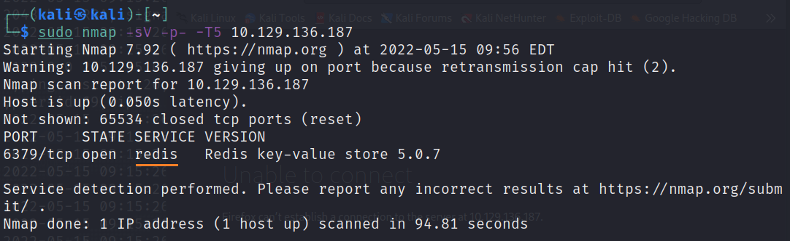
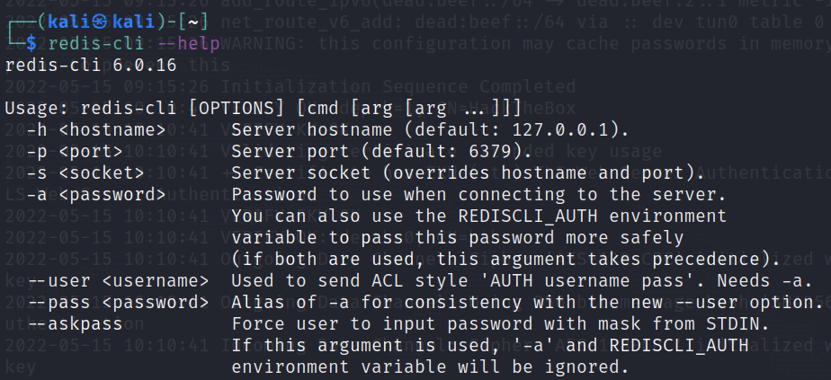
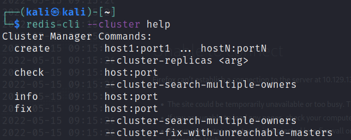
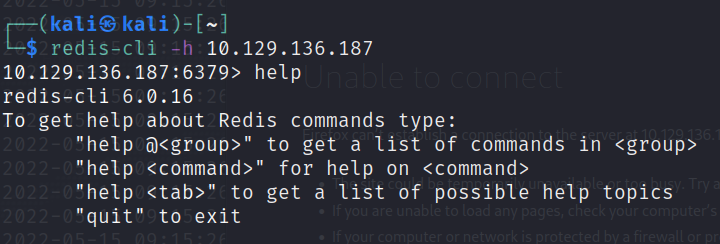
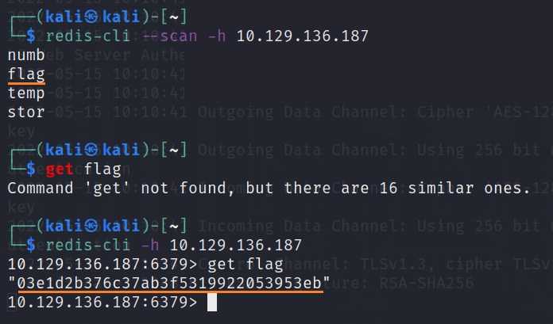

# Redeemer

This is my fourth machine when learning the basics of penetration testing. Tags included in this machine are:

- Enumeration
- Redis
- Linux
- Penetration Tester Level 1
- Anonymous/Guest Access

## <ins>**Questions**

* [Questions 1-3](Misc/questions_1.PNG)
* [Questions 4-6](Misc/questions_2.PNG)
* [Questions 7-10](Misc/questions_3.PNG)

## <ins>**Tasks**

For this machine you have to install redis-cli in order to get the flags for the tasks. You have to use the following commands and read some manuals to get your answers to the questions:

~~~
sudo nmap -sV -p- -T5 <ip address>
redis-cli --help
redis-cli --cluster help
redis-cli -h <ip address>
~~~

## <ins>**Flag**

To list all keys using the <ins>**scan**</ins> command use the following command:

~~~
redis-cli --scan -h <ip address>
~~~

The result for the command stated above is as it follows:

There we can see flag which we have to get with <ins>**get**</ins> command. After that we can open the flag and submit the flag. Hurray!