# Responder

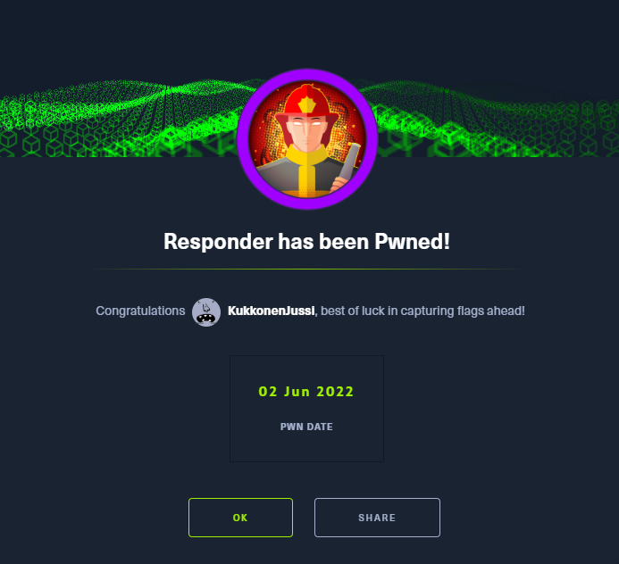

This is my ninth machine when learning the basics of penetration testing. Tags in this machine are:

- SAMBA
- Enumeration
- Apache
- WinRM

## <ins>**Questions**

* [Questions 1-4](Misc/questions_1.PNG)
* [Questions 5-7](Misc/questions_2.PNG)
* [Questions 8-11](Misc/questions_3.PNG) 

## <ins>**Tasks**

For the tasks in this machine we have to use the techniques we have learned before. Let us start with **nmap** command

If we try the ip address of the target machine in the browser it gives an error like so

After using some google for a while I found some possible solutions. One is to check the configurations and make sure both machines can connect to each other. Let us check the configurations from **/etc/hosts/** with the following command:

~~~
nano /etc/hosts/
~~~

We can from the picture that there are only two hosts. Let us add the ip address of the target machine. 

And try to connect to the machine again via browser.

Nice! Now that we are in let us continue with the other tasks. For the next two tasks we have to use wappalyzer and check the url when changing the language.

* [Wappalyzer](Misc/wappalyzer.PNG)
* [URL parameter](Misc/language.PNG)

With the next two tasks we learn some new term which are **LFI** and **RFI**. Those are two common vulnerabilities that typically affect PHP web applications and are cause due to poorly written web applications and/or failing to follow appropriate security practices.

* [LFI](Misc/LFI.PNG)
* [RFI](Misc/RFI.PNG)

In task 8 we have to use new tool which is Responder. Let us read the manual and find the answer for the next task.

Before using any tools for task 10 let us check the output of **ip a** command to see eth ports.

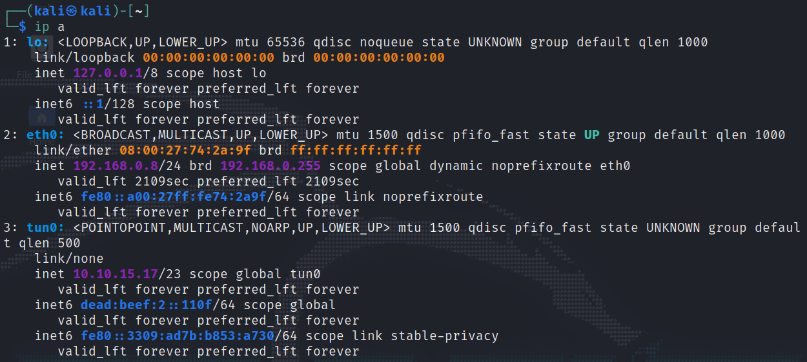

We can see that the eth port that is connected to the target machine is **tun0**. Let us use that for the task 10 with **responder** command.

~~~
sudo responder -I tun0
~~~

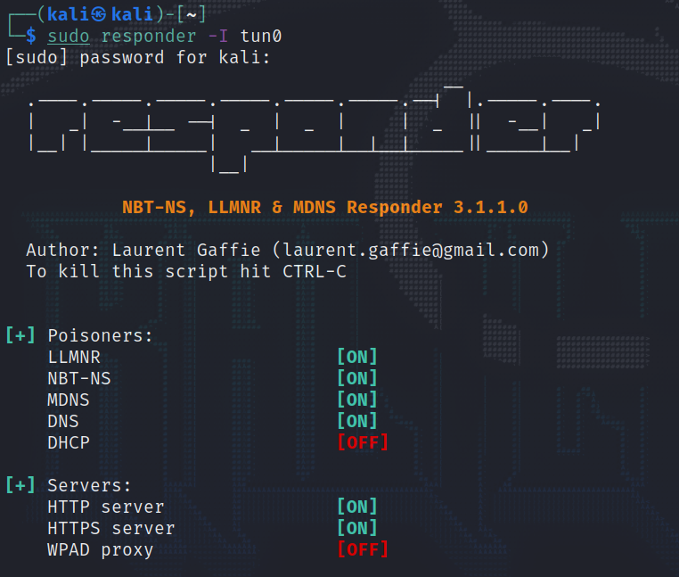

Now that the responder is listening for events. Let us try different things on the web page and see if we can get any information out of the responder.

Okay! Tried all the possible answer options that were in the task 5 and 6. The right thing to do was to replace the ip address with the ip address of the target machine and it worked.

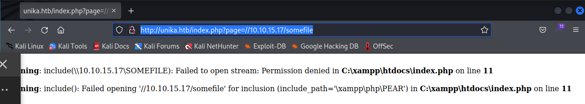
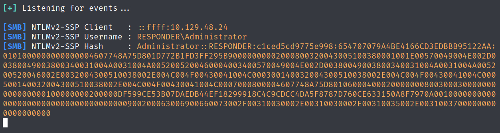

But that is only part of the task. Now we have to use the hash with the John The Ripper tool and get the password for the **administrator** user. Let us create a text file and put the hash inside it.

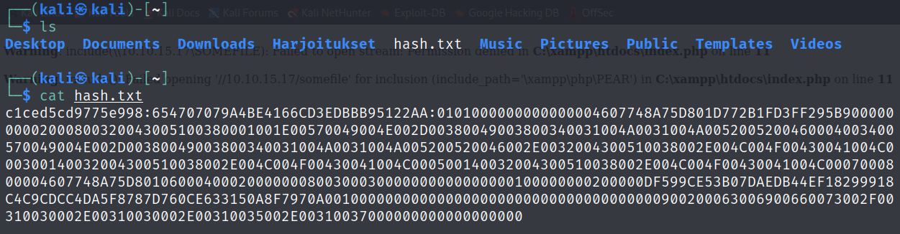

Now example of using John is by giving a wordlist that it checks. There is a wordlist ready in John called rockyou.txt so let us use that. Before using rockyou.txt we have to unzip it if it is not done beforehand. After that you can give a hash for password that it compares and finds the possible answer. The following command one example:

~~~
John --wordlist=rockyou.txt hash
~~~

And boom! We got our password! here is the output of the John command

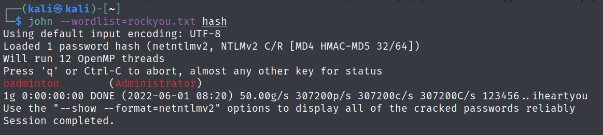

## <ins>**Flag**

Now that we got both username and password for the target machine we have to think how we can get access to the target machine. One possible solution for example is to use tool called evil-winrm. Let us download that and read some manuals.

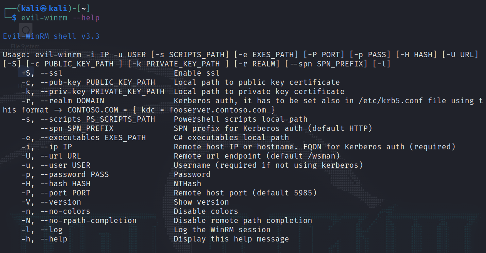

After reading the manuals it seems really straightforward to give it a try with the following command:

~~~
evil-winrm -i IP -u USER
~~~

Nice! we got in! Now let us navigate and see directories if we can find the flag.

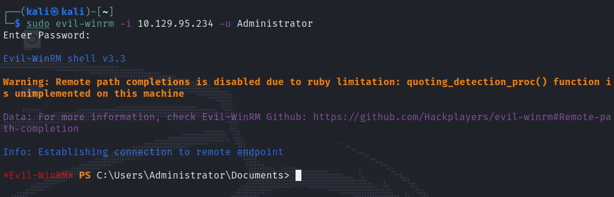

After a while the correct directory was found. Now let us open the flag.txt

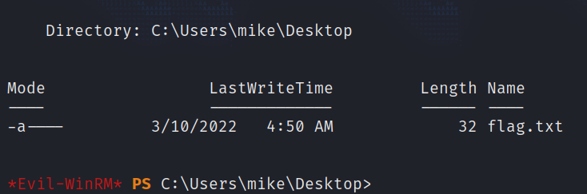

And there we have it! Now we can submit the flag and move on to the next flag! Hurray!

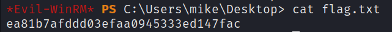