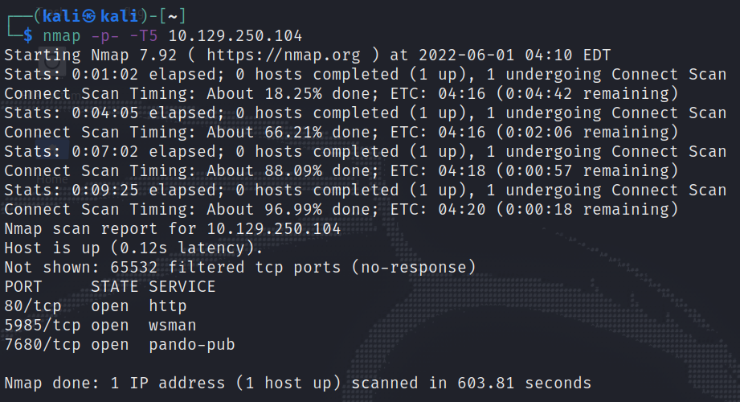
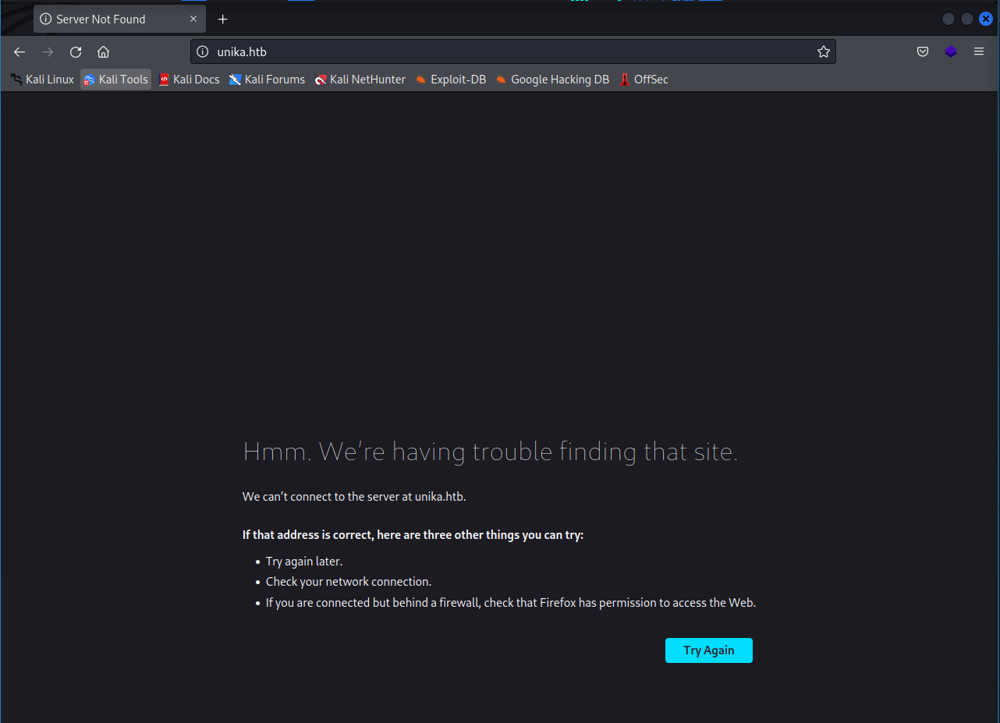
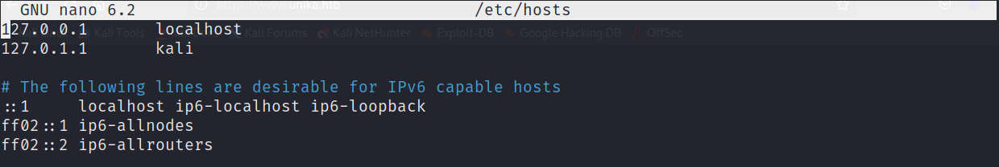
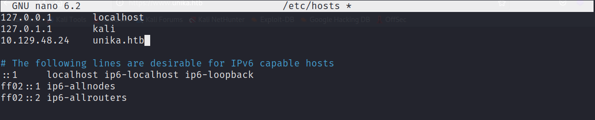

# Responder

This is my ninth machine when learning the basics of penetration testing. Tags in this machine are:

- SAMBA
- Enumeration
- Apache
- WinRM

## <ins>**Questions**

## <ins>**Tasks**

For the tasks in this machine we have to use the techniques we have learned before. Let us start with **nmap** command

If we try the ip address of the target machine in the browser it gives an error like so

After using some google for a while I found some possible solutions. One is to check the configurations and make sure both machines can connect to each other. Let us check the configurations from **/etc/hosts/** with the following command:

~~~
nano /etc/hosts/
~~~

We can from the picture that there are only two hosts. Let us add the ip address of the target machine. 

And try to connect to the machine again via browser.

Nice! Now that we are in let us continue with the other tasks.