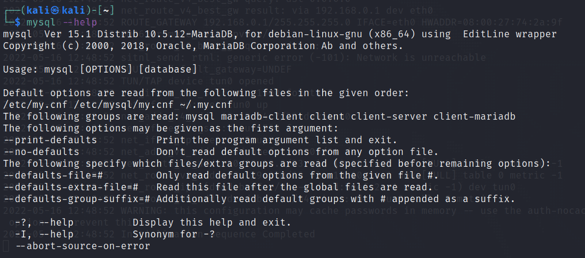

# Sequel

This is my sixth machine when learning the basics of penetration testing. Tags included in this machine are:

- SQL
- MariaDB
- Weak Password

## <ins>**Questions**

* [Questions 1-4](Misc/questions_1.PNG

## <ins>**Tasks**

For this machine you have to use <ins>nmap</ins> command with different switches and also <ins>mysql</ins> as a new command to get the answers for the tasks.

