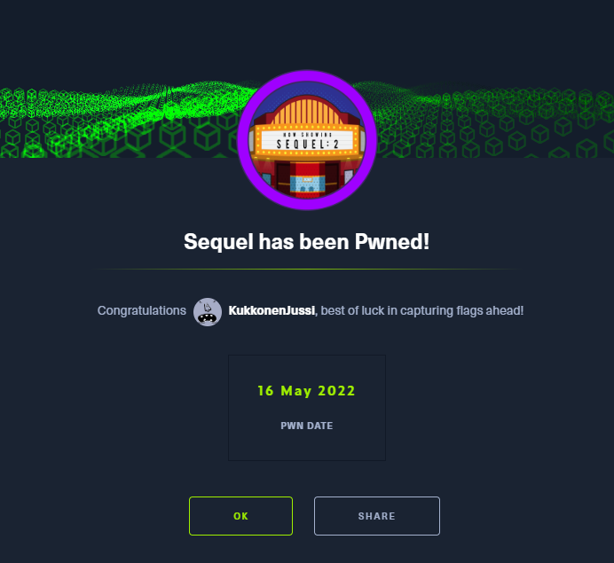
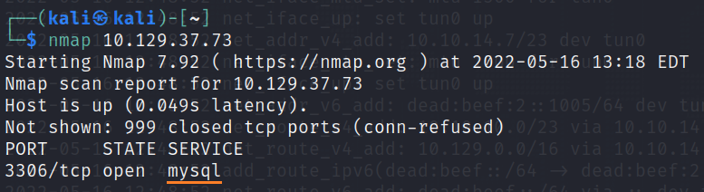
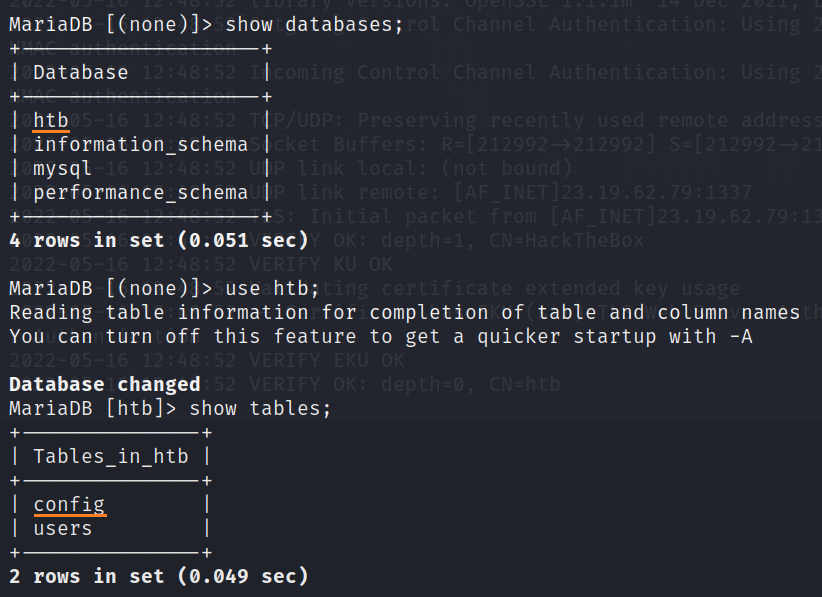
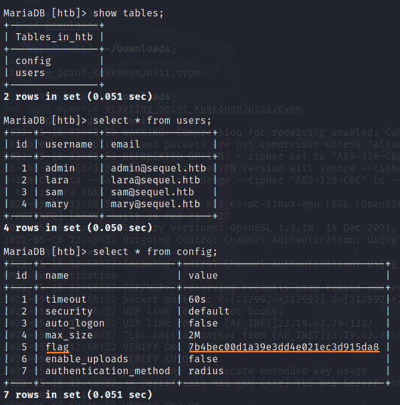

# Sequel

This is my sixth machine when learning the basics of penetration testing. Tags included in this machine are:

- SQL
- MariaDB
- Weak Password

## <ins>**Questions**

* [Questions 1-4](Misc/questions_1.PNG)
* [Questions 5-7](Misc/questions_2.PNG)

## <ins>**Tasks**

For this machine you have to use <ins>nmap</ins> command with different switches and also <ins>mysql</ins> as a new command to get the answers for the tasks.

#### **Nmap**

#### **mysql --help**

## <ins>**Flag**

To connect the target machine you have to use command <ins>mysql</ins>. Nmap showed us the port number which is open and one of the tasks hinted the username **root** so let us try to connect to the machine with the following command:

~~~
mysql -h 3306 -u root
~~~

We got lucky because we are in. Let us read some manuals with **help** command.

Now you have to use mariadb syntax. With the following command we can get a list of all databases.

~~~
show databases;
~~~

Then we have to choose a database. Htb might be the right one so let us choose that one with the following command:

~~~
use htb;
~~~

After that we can see the tables with command:

~~~
show tables;
~~~

Finally let us select everything from config table with the following command:

~~~
select * from config;
~~~

And there we have the flag. Now can submit it and move on to the next machine. Hurray!