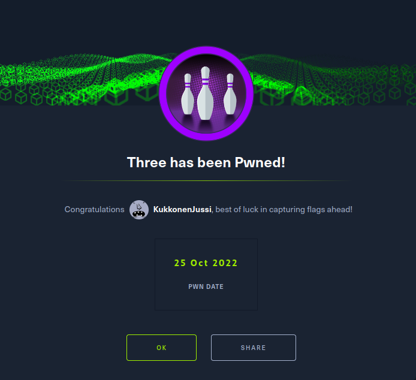
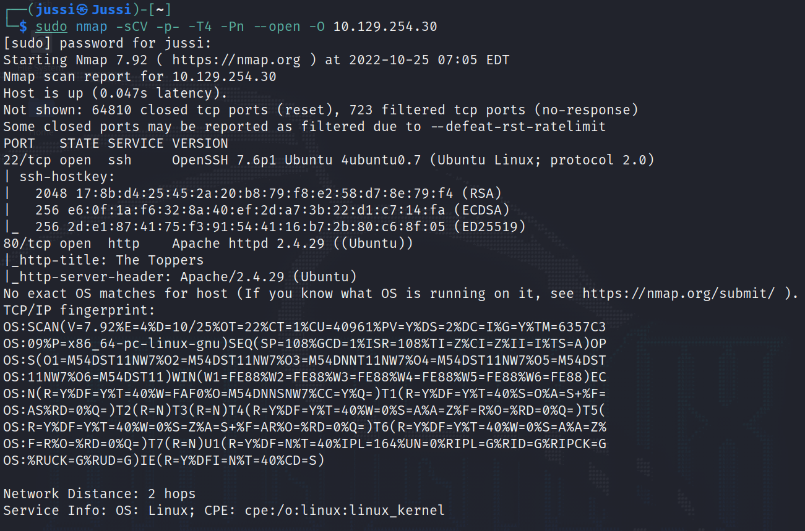
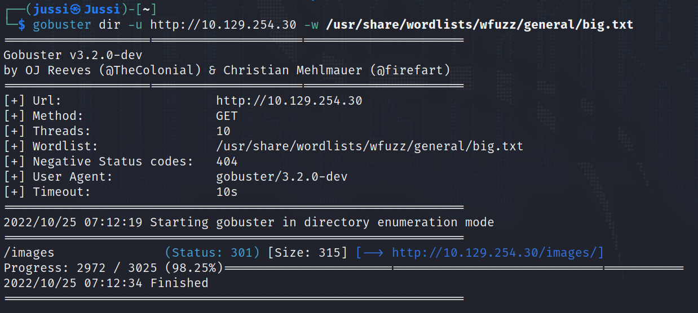
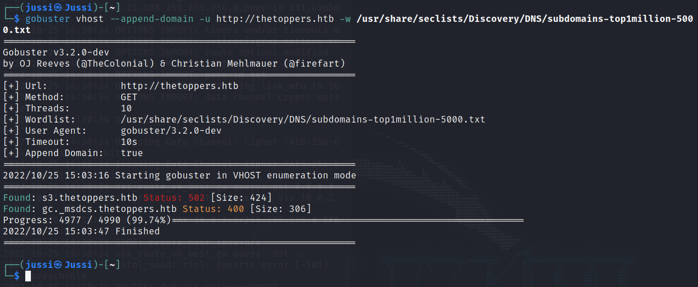

# Sequel

This is my sixth machine when learning the basics of penetration testing. Tags included in this machine are:

- Linux

## <ins>**Questions**

* [Questions 1-3](Misc/questions_1.PNG)
* [Questions 4-6](Misc/questions_2.PNG)
* [Questions 7-9](Misc/questions_3.PNG)

## <ins>**Tasks**

For this machine you need to do port scanning, enumerate the web server and the subdomain, interact with the AWS services and finally get the flag by web shells and reverse shells.

#### **Nmap**

#### **Gobuster**

