# Sequel

This is my sixth machine when learning the basics of penetration testing. Tags included in this machine are:

- Linux

## <ins>**Questions**

* [Questions 1-3](Misc/questions_1.PNG)
* [Questions 4-6](Misc/questions_2.PNG)
* [Questions 7-9](Misc/questions_3.PNG)

## <ins>**Web server enumeration**

For this machine you need to do port scanning, enumerate the web server and the subdomain, interact with the AWS services and finally get the flag by web shells and reverse shells.

#### **Nmap**

#### **Gobuster**

#### **Website**

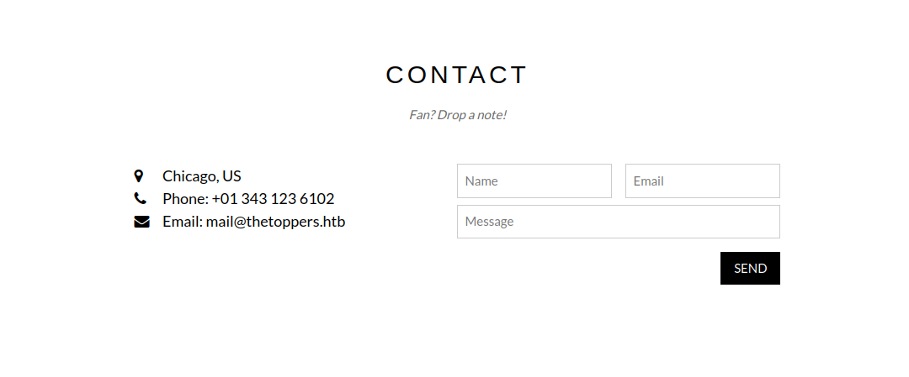

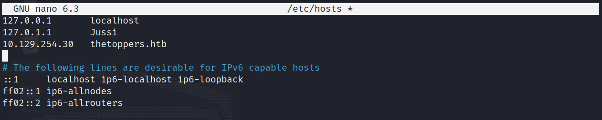

Keep in mind that the ip address of thetoppers.htb changes because I didn't complete the whole machine in one sitting.

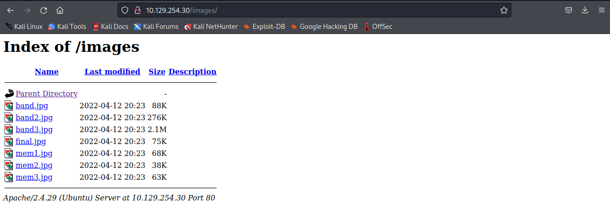

## <ins>**Subdomain enumeration**

## <ins>**AWS Services**

#### **S3 buckets**

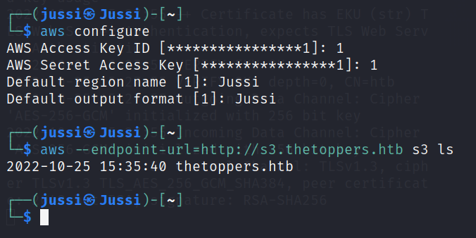

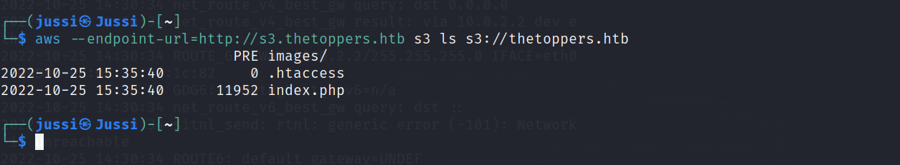

#### **Setting up the listeners**

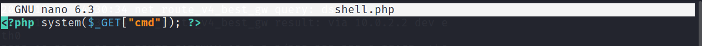

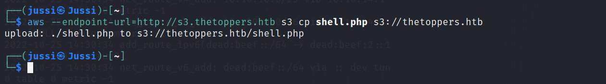

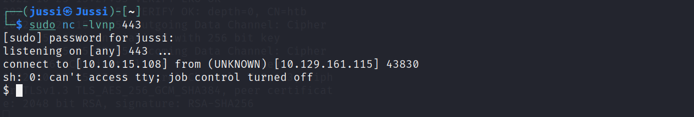

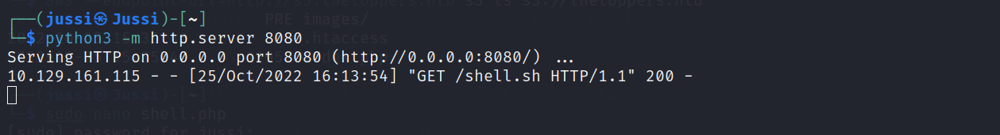

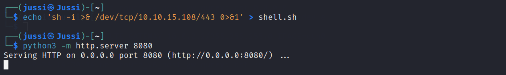

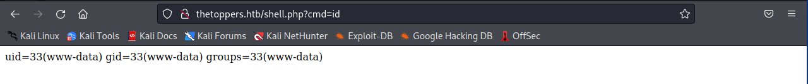

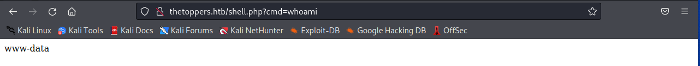

## <ins>**Web shells & Reverse shells**

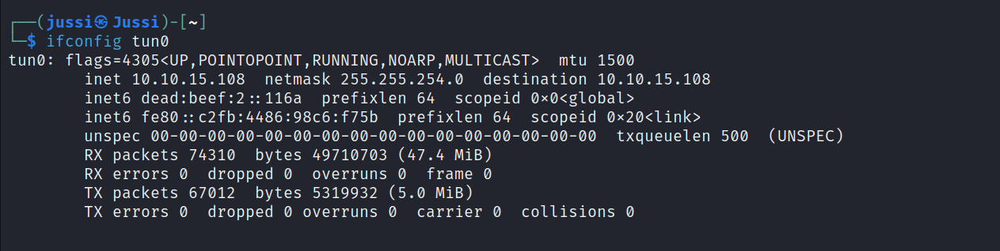

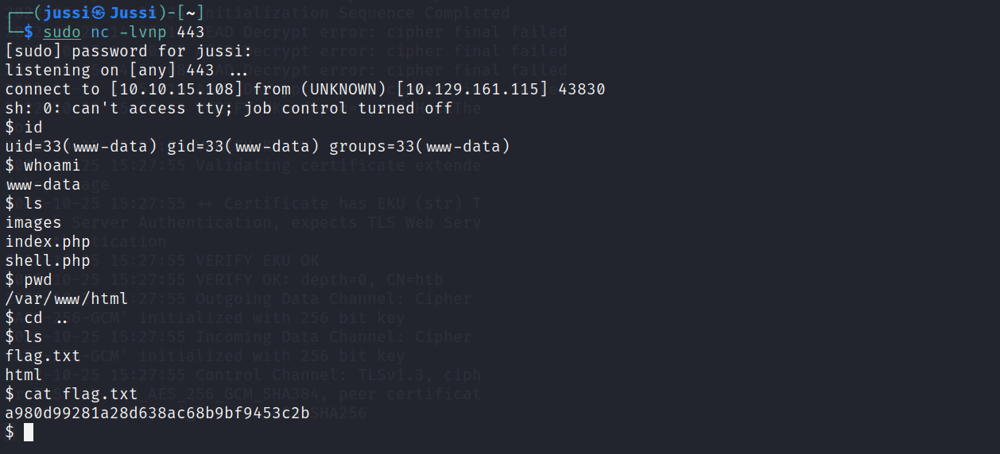

And there we have the flag. Now can submit it and move on to the next machine. Hurray!